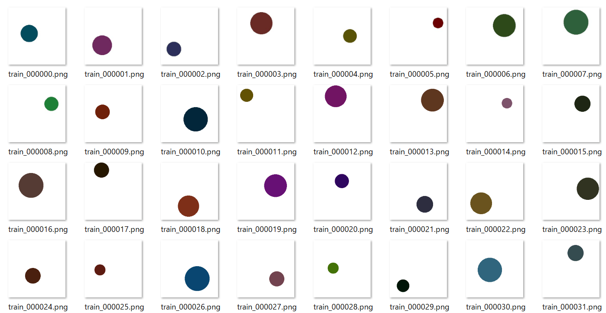
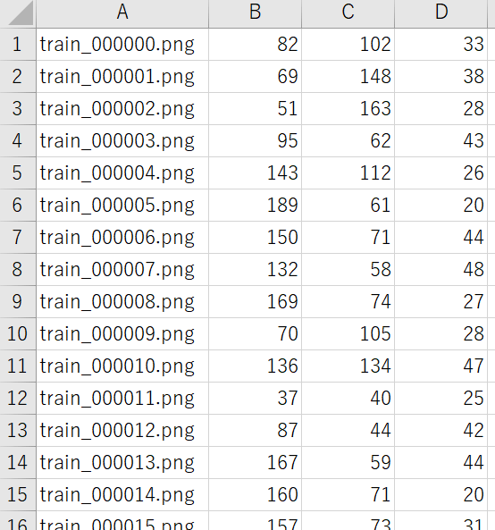
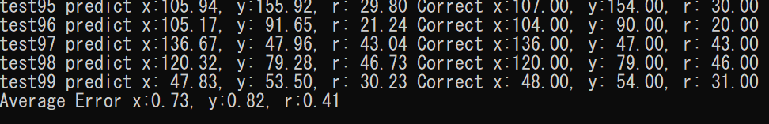
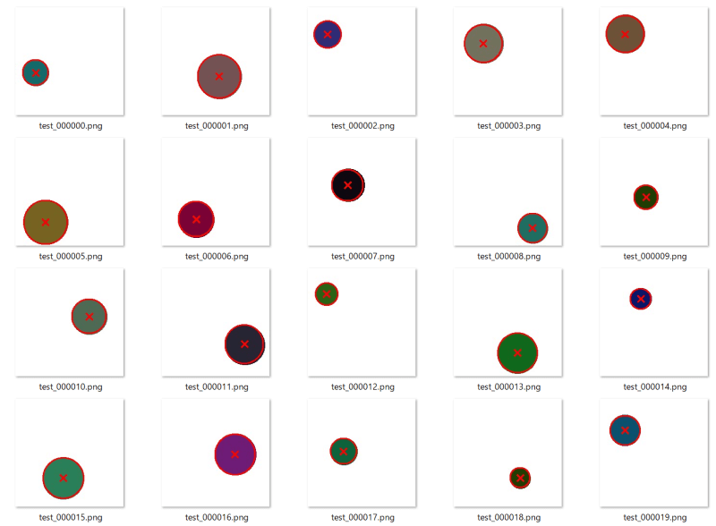

# Circle Detection by CNN

VGG16を利用して、  
CNN単体で円の位置と半径を検出するサンプル

Tensorflow 2.1 + Python3.7にて動作確認

詳細は、以下のブログで解説しています。  
https://maxigundan.com/deeplearning/?p=214

# 使い方

## 1.はじめに 学習用データを生成
`python data_generator.py`

→ 以下のフォルダにデータが生成されます  
dataset/image/train  学習データ 円画像  
dataset/image/valid  学習データ 円画像(validation)  
dataset/image/test  テストデータ 円画像  

dataset/annotation/train.csv  学習データ 円画像の正解データ 座標と半径  
dataset/annotation/valid.csv  学習データ(validation) 円画像の正解データ 座標と半径  
dataset/annotation/test.csv  テストデータ 円画像の正解データ 座標と半径  

## 2.学習
`python train_circle_position_radius.py`

→ 学習を開始します  
checkpoint フォルダ以下にcheckpointが生成されていきます。  
EarlyStoppingは15に設定しています。  
収束したら停止します。

## 3.学習結果のテスト
`python test.py checkpoint/xxx.hdf5`

→ 学習モデルを、dataset/images/test のデータでテストします  
すべての画像の出力結果と正解値、  
そしてエラー平均値が表示されます。  
test_result/ フォルダに、学習結果の画像が出力されます。

